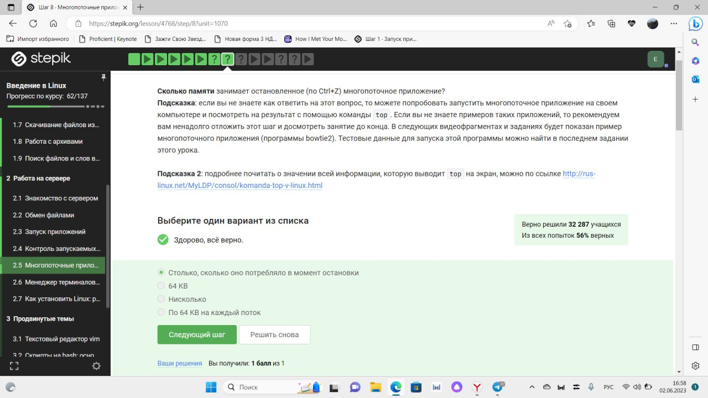

---
## Front matter
title: "Отчет"
subtitle: "Курс "Введение в Linux""
author: "Щанкина Екатерина Викторовна"

## Generic otions
lang: ru-RU
toc-title: "Содержание"

## Bibliography
bibliography: bib/cite.bib
csl: pandoc/csl/gost-r-7-0-5-2008-numeric.csl

## Pdf output format
toc: true # Table of contents
toc-depth: 2
lof: true # List of figures
lot: true # List of tables
fontsize: 12pt
linestretch: 1.5
papersize: a4
documentclass: scrreprt
## I18n polyglossia
polyglossia-lang:
  name: russian
  options:
	- spelling=modern
	- babelshorthands=true
polyglossia-otherlangs:
  name: english
## I18n babel
babel-lang: russian
babel-otherlangs: english
## Fonts
mainfont: PT Serif
romanfont: PT Serif
sansfont: PT Sans
monofont: PT Mono
mainfontoptions: Ligatures=TeX
romanfontoptions: Ligatures=TeX
sansfontoptions: Ligatures=TeX,Scale=MatchLowercase
monofontoptions: Scale=MatchLowercase,Scale=0.9
## Biblatex
biblatex: true
biblio-style: "gost-numeric"
biblatexoptions:
  - parentracker=true
  - backend=biber
  - hyperref=auto
  - language=auto
  - autolang=other*
  - citestyle=gost-numeric
## Pandoc-crossref LaTeX customization
figureTitle: "Рис."
tableTitle: "Таблица"
listingTitle: "Листинг"
lofTitle: "Список иллюстраций"
lotTitle: "Список таблиц"
lolTitle: "Листинги"
## Misc options
indent: true
header-includes:
  - \usepackage{indentfirst}
  - \usepackage{float} # keep figures where there are in the text
  - \floatplacement{figure}{H} # keep figures where there are in the text
---

# Цель работы

В рамках представленного курса познакомиться с операционной системой Linux и ее базовыми возможностями.

# Задание

- Познакомиться с операционной системой Linux

- Узнать базовые возможности операционной системы Linux

# Вводная часть

В курсе будут рассмотрены основные возможности графического интерфейса Linux, которые очень напоминают знакомые большинству слушателей Windows или Mac OS X. После этого мы перейдем к изучению работы через командную строку, которая поначалу может показать не очень удобной, но постепенно станут понятны ее преимущества над графическим подходом.

Следующий блок курса посвящен работе на удаленном сервере. Мы научимся заходить на него, запускать различные программы удаленно, а также копировать результаты их выполнения на свой локальный компьютер для дальнейшего анализа.

Заключительная часть курса рассматривает несколько продвинутых тем, включающих в себя основы написания скриптов на языке bash, использование многофункционального текстового редактора vim и другие.

В течение курса всем слушателям будет предложен ряд тестов и практических заданий на понимание и использование системы Linux. Кроме того, будет и несколько заданий по написанию небольших программ на языке bash.

# Выполнение 1 части курса

В 1.1 я познакомилась с курсом в общем, узнала что именно я буду изучать. (рис. @fig:001, @fig:002).

{#fig:001 width=70%}

{#fig:001 width=70%}

Раздел 1.2 называется "Как установить Linux". Из этого раздела я узнала, что чтобы работать на Linux не обязательно иметь эту операционную систему. Можно скачать виртуальную машину и на нее установить Linux.(рис. @fig:003, @fig:004, @fig:005)

{#fig:003 width=70%}

{#fig:004 width=70%}

{#fig:005 width=70%}

В разделе 1.3 я узнала как устанавливать разные программы и создавать файлы. Также было одно из заданий, где мне нужно было создать файл и написать пару фраз в текстовом редакторе Linux.(рис. @fig:006, @fig:007, @fig:008, @fig:009)

{#fig:006 width=70%}

{#fig:007 width=70%}

{#fig:008 width=70%}

{#fig:009 width=70%}

В разделе 1.4 изучила основы терминала и выполнила все задания.(рис. @fig:010, @fig:011, @fig:012, @fig:013, @fig:014)

{#fig:010 width=70%}

{#fig:011 width=70%}

{#fig:0012 width=70%}

{#fig:013 width=70%}

{#fig:014 width=70%}

в 1.5 я узнала как запускать исполняемые файлы и работать с ними. Выполняла задания с помощью установленной операционной системы Linux на виртуальной машине, а также  при помощи информации, которую получила в видео в данном разделе.(рис. @fig:015, @fig:016, @fig:017)

{#fig:015 width=70%}

{#fig:016 width=70%}

{#fig:017 width=70%}

В следующем разделе я узнала новую информацию о вводе и выводе.(рис. @fig:018, @fig:019, @fig:020)

{#fig:018 width=70%}

{#fig:019 width=70%}

{#fig:020 width=70%}

Раздел 1.7 рассказывает о команде wget, с помощью которой можно скачивать файлы из интернета.(рис. @fig:021, @fig:022, @fig:023)

{#fig:021 width=70%}

{#fig:022 width=70%}

{#fig:023 width=70%}

Из раздела 1.8 под названием "Работа с архивами" я узнала как распаковывать архивы с помощью команд. Для разных расширений архивов нужно использовать разные команды. А также узнала разницу расширений архивов.(рис. @fig:024, @fig:025, @fig:026)

{#fig:024 width=70%}

{#fig:025 width=70%}

{#fig:026 width=70%}

1.9 - раздел о поиске файлов и слов в файле. В одном из заданий  мне нужно было скачать архив с произведениями Шекспира. Я сгенерировала файл со всеми строчками произведений Шекспира со словом love.(рис. @fig:027, @fig:028, @fig:029)

{#fig:027 width=70%}

{#fig:028 width=70%}

{#fig:029 width=70%}

# Выполнение 2 части курса

Вторая часть курса связана с серверами. Я узнала как обмениваться файлами, запускать приложения на сервере. А также узнала, что можно запускать задачи в несколько потоков, чтобы быстрее их выполнять. Изучила команды, с помощью которых можно контролировать запущенные приложения.

Также у нас были очень интересные задания по терминалу на самом сайте.

Вот пример заданий и вопросов в данной части курса:
(рис. @fig:030, @fig:031, @fig:032, @fig:033, @fig:034, @fig:035, @fig:036, @fig:037, @fig:038, @fig:039)

{#fig:030 width=70%}

{#fig:031 width=70%}

{#fig:032 width=70%}

{#fig:033 width=70%}

{#fig:034 width=70%}

{#fig:035 width=70%}

{#fig:036 width=70%}

{#fig:037 width=70%}

{#fig:038 width=70%}

{#fig:039 width=70%}

# Выполнение 3 части курса

В третьей части курса я узнала о таком текстовом редакторе, как vim. Научилась работать с этим редактором. С помощью этого редактора можно быстро и легко редактировать файлы.

Вот пара примеров заданий: (рис. @fig:041, @fig:042, @fig:043, @fig:044, @fig:045, @fig:046, @fig:047)

{#fig:041 width=70%}

{#fig:042 width=70%}

{#fig:043 width=70%}

{#fig:044 width=70%}

{#fig:045 width=70%}

{#fig:046 width=70%}

{#fig:047 width=70%}

# Итог

Подтвердила свои знание сертификатом с отличием (рис. @fig:040). В дальнейшем буду использовать полученные знания на практике.

{#fig:040 width=70%}

# Выводы

Познакомилась с операционной системой Linux и ее базовыми возможностями. Научилась работать на сервере, освоила разные команды для работы в терминале. 

